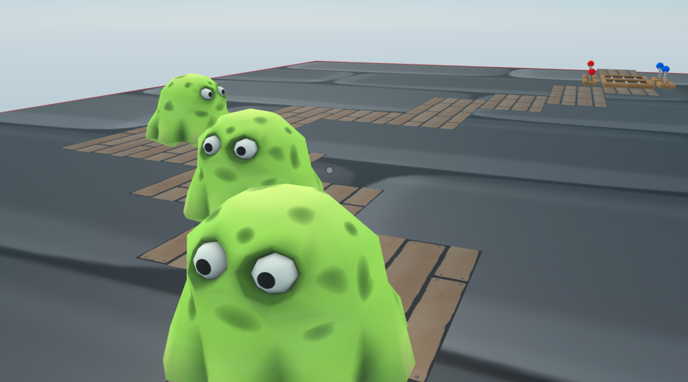

## Tower defense game (WIP)

A fully-fledged game where a random 2d path is generated along which enemies walk, and where traps are randomly placed. You need to activate the traps as the enemies advance along the path to kill them. It’s all about timing.



<!--
[Explore the scene](): this link takes you to a copy of the scene deployed to a remote server where you can interact with it just as if you were running `dcl start` locally.
-->

**Install the CLI**

Download and install the Decentraland CLI by running the following command

```bash
npm i -g decentraland
```

For a more details, follow the steps in the [Installation guide](https://docs.decentraland.org/documentation/installation-guide/).


**Previewing the scene**

Once you've installed the CLI, download this example and navigate to its directory from your terminal or command prompt.

_from the scene directory:_

```
$:  dcl start
```

Any dependencies are installed and then the CLI will open the scene in a new browser tab automatically.

**Usage**

Click the button on the rock to start a new game. Blob monsters will start to appear and walk along the path. Kill them by triggering both levers on a trap. Traps are active for a short period of time, so be careful with the timing. Once a trap is activated, another appears on a random spot along the path.

Learn more about how to build your own scenes in our [documentation](https://docs.decentraland.org/) site.